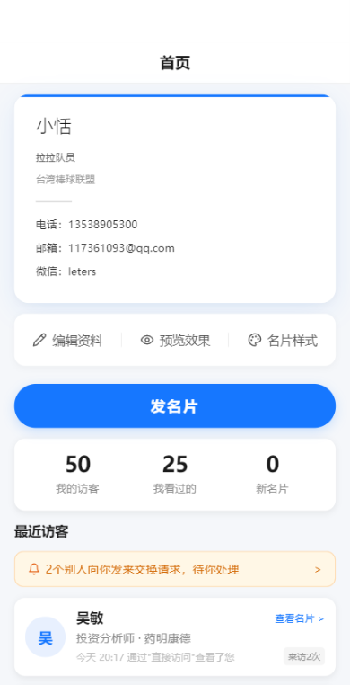
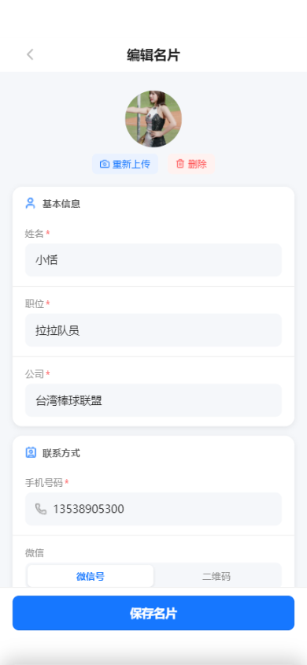
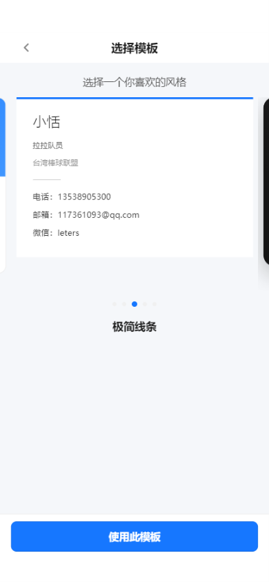
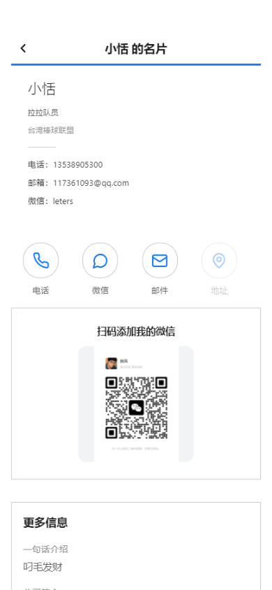
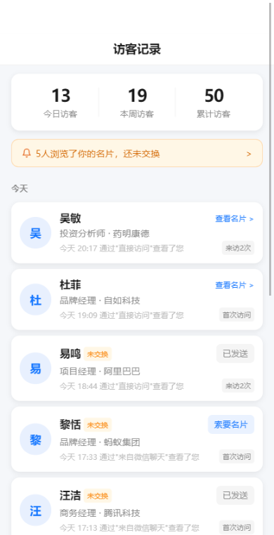
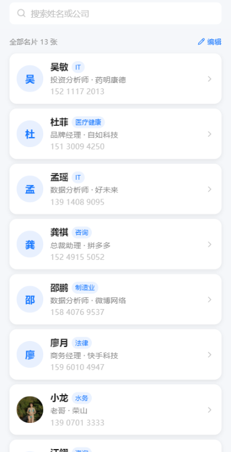
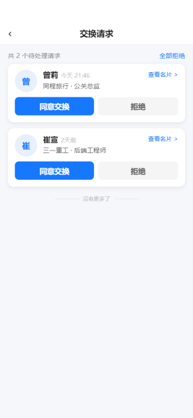
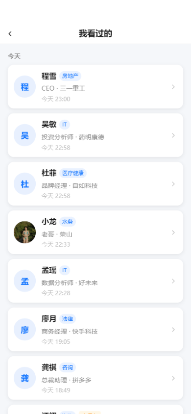
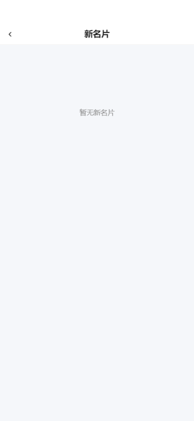
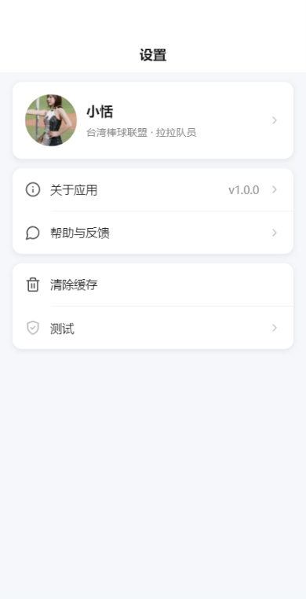

# 名片秒递 — 用户操作手册

> 版本：v1.0.0 | 更新日期：2026-03-25

---

## 目录

1. [产品简介](#1-产品简介)
2. [适用场景](#2-适用场景)
3. [快速上手](#3-快速上手)
4. [首页：查看和分享我的名片](#4-首页查看和分享我的名片)
5. [创建与编辑名片](#5-创建与编辑名片)
6. [选择名片模板](#6-选择名片模板)
7. [查看名片详情与保存名片](#7-查看名片详情与保存名片)
8. [访客记录](#8-访客记录)
9. [名片夹管理](#9-名片夹管理)
10. [交换请求处理](#10-交换请求处理)
11. [浏览记录与新名片](#11-浏览记录与新名片)
12. [设置与缓存清理](#12-设置与缓存清理)
13. [常见问题](#13-常见问题)
14. [附录：页面路径与功能映射](#14-附录页面路径与功能映射)

---

## 1. 产品简介

**名片秒递**是一款微信小程序，帮助你在 30 秒内创建一张专属电子名片，并通过微信聊天、群聊等渠道快速分享给他人。对方查看你的名片后，双方可以互相交换名片，建立商务联系。

核心功能包括：

- **创建名片**：填写个人信息，一键生成精美电子名片
- **分享名片**：通过微信分享给好友或群聊
- **名片交换**：对方保存你的名片后，系统自动完成双向交换
- **访客追踪**：查看谁浏览了你的名片，了解人脉动态
- **名片夹**：统一管理通过交换获得的所有名片
- **多款模板**：提供经典商务、现代简约、极简线条、深色高端、优雅圆润五种风格

---

## 2. 适用场景

- **商务社交**：参加展会、会议、沙龙时快速交换联系方式
- **日常拓展**：微信群内自我介绍时附上电子名片
- **线上对接**：远程沟通时发送名片，替代手动输入联系方式
- **人脉管理**：集中管理收到的名片，按姓名或公司搜索查找

---

## 3. 快速上手

新用户第一次使用名片秒递的最短路径如下：

1. **打开小程序**：在微信中搜索"名片秒递"，或通过好友分享的名片进入
2. **进入首页**：首次进入时，首页显示空状态，提示"欢迎使用名片秒递"
3. **创建名片**：点击首页的「制作我的名片」按钮，进入名片编辑页
4. **填写信息**：依次填写姓名、职位、公司（必填）和手机号（必填），以及可选的头像、微信、邮箱、地址等
5. **保存名片**：点击页面底部「生成我的名片」按钮，名片创建成功后自动返回首页
6. **分享名片**：在首页点击「发名片」按钮，选择微信好友或群聊发送
7. **查看访客**：对方打开你的名片后，首页的"我的访客"数字会更新，你可在"访客"Tab 查看详情
8. **完成交换**：对方保存你的名片后，系统自动完成双向交换，双方名片分别出现在彼此的名片夹中

---

## 4. 首页：查看和分享我的名片

首页是你使用名片秒递的核心入口，展示你的名片和人脉动态。

### 页面说明

首页分为以下几个区域：

- **名片展示区**：以你选择的模板样式展示名片，包含姓名、职位、公司、联系方式等信息
- **工具栏**：提供三个快捷操作入口——「编辑资料」「预览效果」「名片样式」
- **发名片按钮**：点击后通过微信分享名片给好友或群聊
- **数据统计区**：显示"我的访客""我看过的""新名片"三个统计数字，点击可进入对应页面
- **最近访客区**：显示最近浏览过你名片的访客列表
- **交换请求提醒**：当有人向你发送交换请求时，这里会显示待处理数量

### 操作步骤

1. **分享名片**：点击蓝色「发名片」按钮，在弹出的微信分享面板中选择好友或群聊
2. **编辑资料**：点击工具栏中的「编辑资料」，进入名片编辑页修改个人信息
3. **预览名片**：点击「预览效果」，查看你的名片在对方手机上的实际展示效果
4. **切换样式**：点击「名片样式」，进入模板选择页更换名片风格
5. **查看访客**：点击统计数字区域的"我的访客"，跳转到访客记录 Tab
6. **处理请求**：如果出现"X个别人向你发来交换请求"提示条，点击可进入交换请求列表

### 注意事项

- 首页显示的名片信息为实时数据，编辑保存后会立即更新
- 首次创建名片前，首页仅显示空状态引导页
- 下拉页面可刷新数据

---

## 5. 创建与编辑名片

创建或编辑名片使用同一个表单页面，可从首页的「编辑资料」或设置页的个人资料卡片进入。

### 页面说明

名片编辑页分为三大区域：

- **头像区**：上传个人头像照片，支持重新上传和删除
- **基本信息**：姓名（必填）、职位（必填）、公司（必填）
- **联系方式**：手机号码（必填）、微信（支持微信号或二维码两种方式）
- **更多信息**（选填）：邮箱、地址、行业、一句话简介、公司简介

### 操作步骤

1. **上传头像**：点击顶部头像区域，从相册选择照片上传；上传后可点击「重新上传」更换或「删除」移除
2. **填写基本信息**：
   - 输入姓名（最多 20 字）
   - 输入职位（最多 30 字）
   - 输入公司名称（最多 50 字）
3. **填写联系方式**：
   - 输入手机号码（必填，6-20 位数字）
   - 微信：可选择"微信号"直接输入文字，或选择"二维码"上传微信二维码图片
4. **填写更多信息**（可选）：
   - 邮箱地址
   - 公司地址
   - 行业：点击后弹出行业选择面板，支持一级/二级行业分类
   - 一句话简介（最多 100 字）
   - 公司简介（最多 500 字）
5. **保存**：填完后点击底部「保存名片」（编辑模式）或「生成我的名片」（创建模式）按钮

### 注意事项

- 带 * 号的字段为必填项，全部填写后底部按钮才会变为可点击状态
- 上传的头像和二维码会自动压缩，节省流量
- 手机号和邮箱格式错误时会实时提示
- 编辑模式下底部还会出现「删除名片」入口（需确认操作，删除后不可恢复）
- 隐私提示：你的信息仅展示给交换名片的对象

---

## 6. 选择名片模板

名片秒递提供 5 种预设模板风格，可随时切换。

### 页面说明

模板选择页以左右滑动卡片（Swiper）的方式展示所有模板，每张卡片使用你的真实信息进行实时预览。底部显示当前模板名称和指示点。

### 可选模板

| 模板名称 | 风格描述 |
|---------|---------|
| 经典商务 | 蓝色主调，正式商务风格 |
| 现代简约 | 简洁现代，适合科技互联网行业 |
| 极简线条 | 大面积留白，线条点缀 |
| 深色高端 | 深色背景，适合高端商务场合 |
| 优雅圆润 | 圆角卡片，温和专业的视觉感 |

### 操作步骤

1. 从首页点击工具栏中的「名片样式」进入模板选择页
2. 左右滑动浏览不同模板，或点击卡片直接选中
3. 确认选择后点击底部「使用此模板」按钮
4. 系统保存新模板设置并返回上一页，首页名片会同步更新

### 注意事项

- 切换模板不会影响你已填写的个人信息，仅改变视觉风格
- 切换后对方查看到的名片样式也会同步更新

---

## 7. 查看名片详情与保存名片

当你收到他人分享的名片或在访客/名片夹中查看某人名片时，会进入名片详情页。

### 页面说明

名片详情页展示完整的名片信息，包括：

- **名片卡片**：以对方选择的模板风格展示姓名、职位、公司、联系方式
- **快捷操作**：电话、微信、邮件、地址四个图标按钮
- **微信二维码**：如对方上传了微信二维码，会在此区域展示，点击可放大查看
- **更多信息**：一句话简介、公司简介、所属行业

### 操作步骤

1. **拨打电话**：点击「电话」图标，弹出操作面板，可选择「拨打电话」或「复制电话号码」
2. **复制微信号**：点击「微信」图标，弹出操作面板，点击「复制微信号」
3. **复制邮箱**：点击「邮件」图标，弹出操作面板，点击「复制邮箱地址」
4. **复制地址**：点击「地址」图标，弹出操作面板，点击「复制地址」
5. **查看二维码**：点击微信二维码图片，可全屏预览并长按保存
6. **保存名片**：如果你是通过分享链接查看他人名片，页面底部会出现「保存名片」按钮，点击即可保存到名片夹，同时触发双向交换

### 注意事项

- 如果对方未填写某项联系方式，对应的图标按钮会显示为灰色不可点击状态
- 不能保存自己的名片，系统会提示"不能保存自己的名片"
- 保存名片后按钮变为"已保存"状态，并出现「分享给朋友」按钮

---

## 8. 访客记录

访客记录页展示所有浏览过你名片的访客信息，帮助你了解人脉动态。

### 页面说明

访客记录页分为：

- **统计卡片**：显示"今日访客""本周访客""累计访客"三个数据
- **未交换提醒**：如有访客浏览了名片但尚未交换，会显示提醒条
- **访客列表**：按日期分组（今天、昨天、具体日期），每条记录显示访客头像、姓名、公司职位、访问时间、访问来源和交换状态

### 访客状态说明

| 状态标签 | 含义 |
|---------|------|
| 未交换 | 对方浏览了你的名片但尚未保存交换 |
| 查看名片 > | 已完成交换，点击可查看对方完整名片 |
| 索要名片 | 对方尚未与你交换，你可以主动发起交换请求 |
| 已发送 | 你已向对方发送交换请求，等待对方处理 |
| 首次访问 | 对方第一次浏览你的名片 |
| 来访 N 次 | 对方多次浏览你的名片 |

### 操作步骤

1. 点击底部 Tab 栏的「访客」进入访客记录页
2. 查看统计数据了解名片曝光情况
3. 如有"X人浏览了你的名片，还未交换"提醒，点击可查看未交换访客列表
4. 对于已交换的访客，点击「查看名片 >」可进入对方名片详情
5. 对于未交换的访客，点击「索要名片」按钮可向对方发送交换请求
6. 上拉加载更多访客记录，下拉刷新获取最新数据

### 注意事项

- 匿名访客（未创建名片的用户）会显示默认头像和"访客"名称
- 访客记录按最近访问时间排序
- 同一访客多次浏览会合并为一条记录，显示来访次数

---

## 9. 名片夹管理

名片夹集中管理你通过交换获得的所有名片。

### 页面说明

名片夹页面包括：

- **搜索栏**：支持按姓名或公司搜索
- **名片列表**：显示所有已保存的名片，包含头像、姓名、公司、职位等信息
- **编辑模式**：支持批量选择和删除

### 操作步骤

1. 点击底部 Tab 栏的「名片夹」进入
2. **搜索名片**：在顶部搜索框输入姓名或公司关键词，点击搜索按钮或回车进行搜索
3. **查看名片**：点击列表中的某张名片，进入该名片的详情页
4. **批量删除**：
   - 点击列表顶部右侧的「编辑」按钮进入编辑模式
   - 勾选要删除的名片（可多选）
   - 点击底部出现的「删除(N)」按钮
   - 在弹出的确认对话框中点击「确定」完成删除
   - 点击「完成」退出编辑模式
5. **清除搜索**：点击搜索框右侧的 × 按钮清除关键词，恢复显示全部名片

### 注意事项

- 名片夹为空时会提示"还没有保存的名片"，并提供"去交换名片"的快捷入口
- 搜索无结果时会提示"没有找到匹配的名片"
- 删除名片夹中的名片不影响对方的名片夹
- 上拉可加载更多名片

---

## 10. 交换请求处理

当其他用户向你发起名片交换请求时，你可以在此页面进行处理。

### 页面说明

交换请求列表页显示所有待处理的交换请求，每条请求显示对方的头像、姓名、公司职位、发送时间，以及"同意交换"和"拒绝"两个操作按钮。

### 操作步骤

1. 通过以下方式进入交换请求页：
   - 首页的"X个别人向你发来交换请求"提醒条
   - 访客记录中点击"处理"按钮
2. **查看对方名片**：点击请求卡片右上角的「查看名片 >」，预览对方的完整名片信息
3. **同意交换**：点击「同意交换」按钮，进入确认页面：
   - 页面展示对方的名片预览
   - 点击底部「同意交换」完成互相保存
   - 交换成功后显示"交换成功 ✓"，可点击「查看名片」进入对方详情页
4. **拒绝请求**：点击「拒绝」按钮，确认后该请求将被关闭
5. **全部拒绝**：点击列表顶部的「全部拒绝」链接，可一次性拒绝所有待处理请求

### 注意事项

- 同意交换后，双方名片会自动保存到彼此的名片夹中
- 拒绝后对方不会收到拒绝通知，也不会分享你的名片给对方
- 交换请求 7 天内未处理将自动过期
- 每人每天最多可发送 100 次交换请求

---

## 11. 浏览记录与新名片

### 我看过的

"我看过的"页面记录了你浏览过的所有他人名片，按日期分组展示。

#### 操作步骤

1. 在首页点击统计区的"我看过的"数字进入
2. 按日期分组浏览历史记录
3. 每条记录显示对方姓名、行业标签、公司职位、浏览时间
4. 点击任意一条记录可进入对方名片详情页
5. 未保存的名片会显示"未保存"标签

### 新名片

"新名片"页面展示通过交换或其他途径新获得的名片。

#### 操作步骤

1. 在首页点击统计区的"新名片"数字进入
2. 页面顶部显示未查看的名片数量
3. 点击「全部标记已读」可将所有新名片标记为已读
4. 点击某张名片进入详情页查看

---

## 12. 设置与缓存清理

设置页提供个人资料管理和应用设置功能。

### 页面说明

设置页包含以下功能区域：

- **个人资料卡片**：显示当前头像、姓名、公司和职位，点击可进入名片编辑页
- **关于应用**：查看当前版本号和更新日志
- **帮助与反馈**：进入客服通道反馈问题
- **清除缓存**：清除应用的接口缓存和临时图片链接

### 操作步骤

1. 点击底部 Tab 栏的「我」进入设置页
2. **编辑名片**：点击顶部个人资料卡片，进入名片编辑页
3. **查看关于**：点击「关于应用」查看版本号和更新日志
4. **帮助反馈**：点击「帮助与反馈」进入客服通道
5. **清除缓存**：点击「清除缓存」，在弹出的确认对话框中点击「确定」

### 注意事项

- 清除缓存只会清除接口缓存和临时图片链接，**不会**删除你的名片信息和登录状态
- 清除缓存后，部分页面会重新加载数据，可能需要等待片刻

---

## 13. 常见问题

### 为什么首页看不到我的名片？

你尚未创建名片。首页空状态下会显示「制作我的名片」按钮，点击后填写信息即可创建。如果你确认已创建过名片但仍看不到，可尝试下拉刷新首页或到设置页清除缓存后重新打开小程序。

### 为什么有些页面显示为空？

- **名片夹为空**：你还没有通过交换获得任何名片。分享名片给他人，对方保存后即可完成交换
- **访客记录为空**：你的名片尚未被他人浏览。将名片分享给好友或群聊后，来访记录会出现在这里
- **新名片为空**：目前没有新收到的名片

### 如何修改名片信息？

有两种方式：
1. 在首页点击工具栏中的「编辑资料」
2. 在"我"（设置）页面点击顶部个人资料卡片

进入编辑页面后修改信息，点击「保存名片」即可。修改会实时生效，对方下次查看你的名片时会看到最新信息。

### 如何更换名片样式？

在首页点击工具栏中的「名片样式」，进入模板选择页，左右滑动浏览不同风格，选定后点击「使用此模板」保存。目前共有 5 种模板：经典商务、现代简约、极简线条、深色高端、优雅圆润。

### 如何删除名片夹中的名片？

进入名片夹 Tab，点击列表右上角的「编辑」按钮，勾选要删除的名片，点击底部的「删除」按钮并确认。删除仅影响你自己的名片夹，不会影响对方。

### 为什么不能保存自己的名片？

系统不允许保存自己的名片到名片夹，这是正常设计。名片详情页在判断为你自己的名片时，不会显示保存按钮。

### 清除缓存会删除我的名片吗？

不会。清除缓存只会清理接口缓存和临时图片链接，你的名片数据存储在云端，不受影响。清除后部分页面会重新加载，建议在网络良好时操作。

### 如何分享名片给群聊？

在首页点击「发名片」按钮，在微信分享面板中选择群聊即可。群内成员点击分享卡片后可查看你的名片并保存。

### 交换请求过期了怎么办？

交换请求的有效期为 7 天。过期后需要对方重新发起请求。你也可以主动到对方的名片页保存名片来发起交换。

---

## 14. 附录：页面路径与功能映射

| 页面名称 | 路径 | 主要用途 |
|---------|------|---------|
| 首页 | `pages/index/index` | 展示我的名片、统计数据、最近访客、分享名片 |
| 访客记录 | `pages/visitors/index/index` | 查看所有访客、统计数据、按日期分组浏览 |
| 未交换访客 | `pages/visitors/unexchanged/unexchanged` | 查看浏览过名片但未交换的访客 |
| 名片夹 | `pages/cardbook/index/index` | 管理已保存的名片、搜索、编辑、删除 |
| 设置 | `pages/settings/index/index` | 个人资料、关于应用、帮助反馈、清除缓存 |
| 创建/编辑名片 | `pages/create/form/form` | 填写或修改个人名片信息 |
| 选择模板 | `pages/create/template/template` | 切换名片视觉风格模板 |
| 名片预览 | `pages/create/preview/preview` | 预览名片完整效果 |
| 名片详情 | `pages/card/detail/detail` | 查看某人名片完整信息、快捷操作 |
| 名片分享视图 | `pages/card/view/view` | 通过分享链接进入的名片查看页（含保存/创建引导） |
| 我看过的 | `pages/card/history/history` | 浏览历史记录，按日期分组 |
| 新名片 | `pages/card/friends/friends` | 新收到的名片列表 |
| 交换请求列表 | `pages/request/list/list` | 查看和处理所有待处理的交换请求 |
| 交换请求确认 | `pages/request/confirm/confirm` | 确认或拒绝单个交换请求 |
| 关于应用 | `pages/settings/changelog/changelog` | 查看版本号和更新日志 |

---

> 如有问题或建议，请通过小程序内「我」>「帮助与反馈」联系我们。
